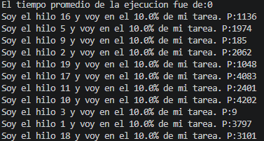
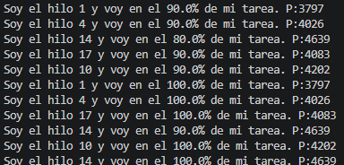
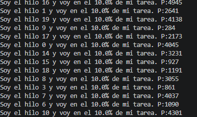
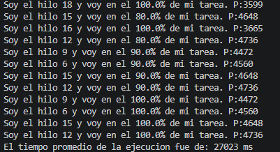

# ARSW - Laboratorio #2

## Sincronización por Barrera en Java

**Autor:** Eduardo Rico Duarte

**Curso:** Arquitecturas de Software (ARSW)

**Institución:** Escuela Colombiana de Ingeniería Julio Garavito

---

# Introducción

El presente laboratorio tiene como objetivo analizar y corregir un problema de sincronización en una aplicación concurrente desarrollada en Java. 

A través de este ejercicio se estudian conceptos fundamentales de concurrencia y coordinación de hilos, así como la importancia de los mecanismos de sincronización en aplicaciones concurrentes.

---

# Marco Teórico

La concurrencia permite que múltiples tareas se ejecuten de manera simultánea mediante el uso de hilos (*Threads*). En Java, los hilos comparten memoria y pueden trabajar de forma paralela, lo que mejora el rendimiento de las aplicaciones.

Cuando varias tareas se ejecutan concurrentemente, es necesario utilizar mecanismos de sincronización para coordinar su ejecución y evitar resultados incorrectos. Una de estas estrategias es la sincronización por barrera, la cual garantiza que un conjunto de hilos alcance un punto determinado antes de que otro proceso pueda continuar.

En este laboratorio se utiliza el método `join()`, que permite al hilo principal esperar la finalización de todos los hilos de trabajo antes de calcular el tiempo promedio de ejecución, asegurando así que los resultados obtenidos sean correctos.


---

# Desarrollo del Laboratorio

## Punto 2. Revisión y ejecución del programa principal

### Objetivo

Ejecutar el programa suministrado, observar su comportamiento y analizar si el cálculo del tiempo promedio de ejecución es correcto.

### Desarrollo

El programa crea 20 hilos (`HiloProc`), cada uno con un tiempo de espera aleatorio. Cada hilo ejecuta una tarea compuesta por 10 iteraciones y registra el tiempo total de ejecución en la variable `resultado`.

Al ejecutar el programa se obtuvo la siguiente  salida:



.
.
.



Se observó que el mensaje del tiempo promedio aparece inmediatamente después de iniciar los hilos, incluso antes de que estos comiencen a completar sus tareas.

### Análisis

El resultado obtenido no es correcto. El promedio calculado es igual a cero debido a que el hilo principal realiza el cálculo inmediatamente después de invocar `start()` sobre los hilos.

La variable `resultado` de cada hilo se inicializa en cero y solamente es actualizada cuando el método `run()` finaliza. Como el hilo principal no espera la terminación de los hilos, el cálculo del promedio se realiza utilizando valores que aún no han sido actualizados.

### Conclusión

El programa presenta un problema de sincronización. El cálculo del promedio se ejecuta antes de que los hilos terminen su trabajo, generando un resultado incorrecto.

---

## Punto 3. Aplicación de una estrategia de sincronización por barrera

### Objetivo

Garantizar que el cálculo del tiempo promedio de ejecución se realice únicamente después de que todos los hilos hayan terminado.

### Desarrollo

Para solucionar el problema se utilizó el método `join()` de Java. Este método permite que el hilo principal espere la terminación de cada uno de los hilos de trabajo antes de continuar con su ejecución.

Se agregó el siguiente bloque de código después de iniciar los hilos:

```java
try {
    for (int i = 0; i < numHilos; i++) {
        hilos[i].join();
    }
} catch (InterruptedException e) {
    e.printStackTrace();
}
```

Una vez que todos los hilos terminan, el programa calcula el promedio utilizando los tiempos reales registrados por cada hilo.

### Explicación de la solución

El método `join()` bloquea la ejecución del hilo principal hasta que el hilo correspondiente finaliza. Al aplicar `join()` sobre todos los hilos del arreglo, el programa garantiza que el cálculo del promedio no se ejecute hasta que todos hayan completado su tarea.

Esta estrategia produce el mismo efecto esperado de una barrera de sincronización para este escenario, ya que obliga al hilo principal a esperar la finalización de todos los participantes antes de continuar.

### Conclusión

La sincronización implementada elimina el problema identificado en el punto anterior y asegura que el promedio sea calculado utilizando información válida y completa.

---

## Punto 4. Verificación del funcionamiento

### Objetivo

Comprobar que la estrategia de sincronización implementada corrige el comportamiento incorrecto del programa.

### Desarrollo

Después de aplicar la sincronización mediante `join()`, el programa fue ejecutado nuevamente.

Durante la ejecución se observó que:

1. Los 20 hilos realizan su trabajo concurrentemente.
2. El hilo principal permanece bloqueado mientras los hilos se ejecutan.
3. Todos los hilos completan sus 10 iteraciones.
4. El mensaje del tiempo promedio aparece únicamente al final de la ejecución.

La salida ahora presenta el siguiente comportamiento:



...



### Análisis

El cambio confirma que el hilo principal espera correctamente la finalización de todos los hilos antes de continuar.

Cuando se realiza el cálculo, todas las instancias de `HiloProc` ya han actualizado su variable `resultado`, por lo que el promedio obtenido corresponde al tiempo real de ejecución de los hilos.

### Conclusión

La solución implementada funciona correctamente y cumple con el objetivo del laboratorio. El cálculo del promedio se realiza únicamente después de que todos los hilos han terminado, eliminando el problema de sincronización presente en la versión original del programa.

---

# Conclusiones Generales

* La concurrencia permite ejecutar múltiples tareas simultáneamente mediante hilos.
* El uso incorrecto de hilos puede generar problemas de sincronización y resultados inconsistentes.
* El método `start()` únicamente inicia la ejecución de un hilo, pero no garantiza su finalización.
* La sincronización es necesaria cuando una operación depende de los resultados producidos por múltiples hilos.
* El método `join()` permite coordinar la ejecución entre el hilo principal y los hilos trabajadores, garantizando que una tarea continúe únicamente cuando todas las demás han terminado.
* La solución implementada permitió obtener un tiempo promedio de ejecución válido y consistente.

---

# Bibliografía

Benavides Navarro, L. D., & Gualtero Martínez, R. H. (2024). *Concurrency and Threads in Java and Go* [Course slides].

OpenAI. (2026). *ChatGPT (GPT-5.5 version)* [Large Language Model]. https://chatgpt.com/ (Used primarily as a support tool.)

Oracle. (2024). Thread (Java Platform, Standard Edition 24 API Specification). Oracle Corporation. https://docs.oracle.com/en/java/javase/24/docs/api/java.base/java/lang/Thread.html